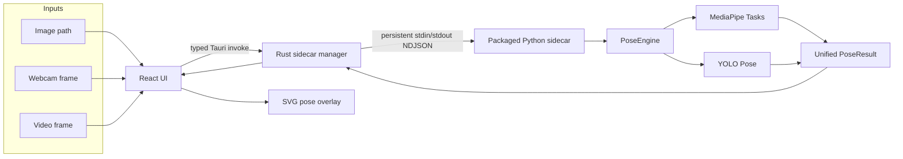

# Human Pose Estimation

**A local Windows desktop application for pose estimation across images, webcams, and video files using MediaPipe and YOLO Pose.**


Human Pose Estimation combines a React interface, a Tauri/Rust desktop bridge, and a packaged Python computer-vision engine. Inference stays on the local machine: there is no web server, cloud inference service, or implicit model download.

## Highlights

- Still-image pose estimation with an aligned SVG overlay
- Explicit, bounded live webcam inference
- Local video playback with fresh-frame pose sampling
- MediaPipe 33-landmark and Ultralytics YOLO Pose backends
- Backend-independent pose contract with deterministic keypoint identities
- Multi-person skeletons, keypoints, and optional bounding boxes
- Persistent Python sidecar with typed Rust ↔ Python errors
- Custom local model selection and deterministic default paths
- Offline-friendly runtime behavior with no silent downloads
- Bundled Python 3.13.5 runtime and Windows NSIS installer

## Screenshots

Real release screenshots are not yet checked into the repository. Product screenshots should be captured from a clean release build—without terminals or personal file paths—and added as:

```text
docs/images/image-mode.png
docs/images/webcam-mode.png
docs/images/video-mode.png
```

No mockup is used here as evidence of the running application.

## Architecture



### Why this design?

- **Persistent sidecar:** Python and initialized pose models are reused instead of starting a new process for every inference.
- **NDJSON process protocol:** local IPC stays explicit and testable without introducing an HTTP server.
- **Backend-independent contract:** application code consumes one `PoseResult` schema rather than MediaPipe or Ultralytics objects.
- **Fresh-frame backpressure:** webcam and video analysis allow one request in flight. If inference is slower than the source, stale frames are skipped rather than queued.
- **Explicit model assets:** model downloads never happen implicitly, keeping startup deterministic and offline-friendly.

More engine and protocol detail is available in the [Python engine documentation](python-engine/README.md).

## Tech Stack

| Layer | Technologies |
|---|---|
| Interface | React 19, Vite 7, JavaScript |
| Desktop shell | Tauri 2, Rust |
| Vision engine | Python 3.13.5, OpenCV, NumPy |
| Pose backends | MediaPipe Tasks, Ultralytics YOLO Pose |
| Local IPC | Persistent line-delimited JSON over process streams |
| Packaging | PyInstaller `onedir`, Tauri, NSIS |

## Supported Backends

| Backend | Status | Contract behavior |
|---|---|---|
| MediaPipe | Supported | Up to 33 canonical landmarks with relative depth-like `z` values |
| YOLO Pose | Supported | COCO 17-keypoint observations mapped into the canonical schema; multi-person output |
| MMPose | Unavailable | No reproducible supported MMCV stack for the current Python 3.13/Windows environment |

The project does not make unsupported accuracy or performance comparisons between backends.

## Installation

### Windows users

The packaged release targets Windows 11 x64. There is currently no public download link; use the installer produced by the release build or supplied by the project maintainer.

1. Run the generated NSIS installer.
2. Launch **Human Pose Estimation**.
3. Select a compatible local model when the default model is reported missing.
4. Choose Image, Webcam, or Video mode.

The installed application includes Python and its runtime dependencies. End users do not need Python, pip, Rust, Node.js, or the source repository.

The installer is currently unsigned, so Windows SmartScreen may display a warning for locally built packages.

## Model Setup

Model weights are intentionally external because redistribution terms have not been established for this project. The application does not download them automatically.

| Backend | Expected development default | Custom selection |
|---|---|---|
| MediaPipe | `models/mediapipe/pose_landmarker.task` | Select a compatible `.task` file with **Browse** |
| YOLO Pose | `models/yolo/yolo11n-pose.pt` | Select a compatible `.pt` file with **Browse** |

Inside the source checkout, place defaults under `python-engine/`:

```text
python-engine/models/mediapipe/pose_landmarker.task
python-engine/models/yolo/yolo11n-pose.pt
```

In an installed build, use **Browse** to select a compatible model when no default is present; users are not expected to find a source-repository directory. File presence means only that an asset exists—backend initialization remains the compatibility check.

Official references:

- [MediaPipe Pose Landmarker models](https://developers.google.com/edge/mediapipe/solutions/vision/pose_landmarker#models)
- [Ultralytics pose estimation documentation](https://docs.ultralytics.com/tasks/pose/)

Review the model provider's current terms before redistributing weights.

## Usage

### Image

1. Choose a PNG, JPEG, BMP, or WebP image.
2. Select MediaPipe or YOLO Pose and confirm a model is available.
3. Select **Estimate Pose**.
4. Inspect the overlay and backend, people, dimensions, and processing-time summary.

### Webcam

1. Select **Start camera** and approve Windows camera permission.
2. Select **Start live pose** when the preview is ready.
3. Stop live pose or the camera independently when finished.

Camera preview rate and inference FPS are separate. Live estimation captures bounded JPEG frames and keeps at most one inference request active.

### Video

1. Choose a local MP4, WebM, MOV, or M4V file supported by WebView2.
2. Use the native video controls to play, pause, or seek.
3. Select **Start pose analysis** explicitly.

Video frames are sampled rather than queued. Seeking invalidates older work, and results too far behind the current playback position are discarded.

## Development

### Requirements

- Windows 11 x64 and WebView2
- Node.js with Yarn 1.x
- Rust toolchain and [Tauri Windows prerequisites](https://v2.tauri.app/start/prerequisites/)
- Python 3.13.5

### Setup

From PowerShell in the repository root:

```powershell
python -m venv python-engine\.venv
.\python-engine\.venv\Scripts\python.exe -m pip install --upgrade pip
.\python-engine\.venv\Scripts\python.exe -m pip install -e ".\python-engine[test]"
yarn install
yarn tauri dev
```

Development starts `.venv\Scripts\python.exe -m app.main` from `python-engine`. `HPE_PYTHON_EXECUTABLE` and `HPE_PYTHON_ENGINE_DIR` are development-only overrides.

## Production Build

Install the pinned packaging extras, then run the coordinated release script:

```powershell
.\python-engine\.venv\Scripts\python.exe -m pip install -e ".\python-engine[package]"
.\scripts\build-windows-release.ps1
```

The script verifies Python 3.13.5, builds and smoke-tests the PyInstaller sidecar, embeds it as a Tauri resource, builds the frontend/Rust application, and creates an unsigned NSIS installer under:

```text
src-tauri/target/release/bundle/nsis/
```

Production ignores development interpreter overrides and never falls back to system Python. Generated runtimes, installers, models, and build directories are excluded from Git.

## Testing

The repository has deterministic unit and transport tests that do not require a GPU, network connection, webcam, video file, or model weights. Real backend integration tests skip cleanly when their local model is absent.

```powershell
# Frontend
yarn test
yarn build

# Python
cd python-engine
.\.venv\Scripts\python.exe -m pytest
.\.venv\Scripts\python.exe -m pytest -m integration -ra

# Rust / Tauri
cd ..\src-tauri
cargo fmt --check
cargo check --locked
cargo test --locked
cargo clippy --locked -- -D warnings

# Frozen protocol/runtime
cd ..
.\scripts\test-packaged-sidecar.ps1 -Executable `
  .\python-engine\dist\hpe-python-sidecar\hpe-python-sidecar.exe
```

Coverage includes pose-contract validation, both backend adapters, visualization, engine selection/lifecycle, NDJSON parsing and recovery, process correlation/timeouts, model discovery, image/frame transport, live-media freshness, UI rendering, and packaged dependency imports.

Latest verified results: **243 Python tests**, **43 frontend tests**, and **23 active Rust tests** passed. The packaged-runtime Rust test also passed when run explicitly, and the packaged Python sidecar smoke test passed independently.

## Project Structure

```text
src/             React interface, overlays, and bounded media schedulers
src-tauri/       Rust process bridge, Tauri commands, and Windows packaging
python-engine/   Pose contracts, backends, PoseEngine, protocol, and tests
scripts/         Reproducible Python and Windows release automation
```

## Engineering Highlights

- Normalizes MediaPipe and YOLO into one typed, backend-neutral result model.
- Preserves structured error codes across Python, NDJSON, Rust, and React while presenting safe user guidance.
- Reuses one lazily initialized estimator per backend inside a persistent process.
- Enforces request IDs, response correlation, timeouts, process-health reset, and clean shutdown.
- Keeps long-running webcam/video analysis memory-bounded with one-in-flight scheduling.
- Resolves development and frozen resources independently of the current working directory.
- Verifies packaged native imports and real Rust → frozen-Python protocol traffic before release.

## Limitations

- Packaged releases currently target Windows x64 only.
- The installer is unsigned.
- Production bundles the CPU-only Torch runtime; no CUDA package is included.
- Model weights are external and must be selected or placed manually.
- MMPose is unavailable under the current Python 3.13/Windows native dependency constraints.
- The application does not provide temporal tracking, smoothing, action recognition, or video export.
- Real release screenshots and a custom project icon are not yet included.
- No license file has been selected for the repository.

## Future Work

- Add a signed Windows release and project-specific icon.
- Add optional GPU packaging after a separate compatibility and size review.
- Revisit MMPose when its native dependency stack supports this environment reproducibly.
- Consider tracking/smoothing and cross-platform installers as separate, scoped features.
